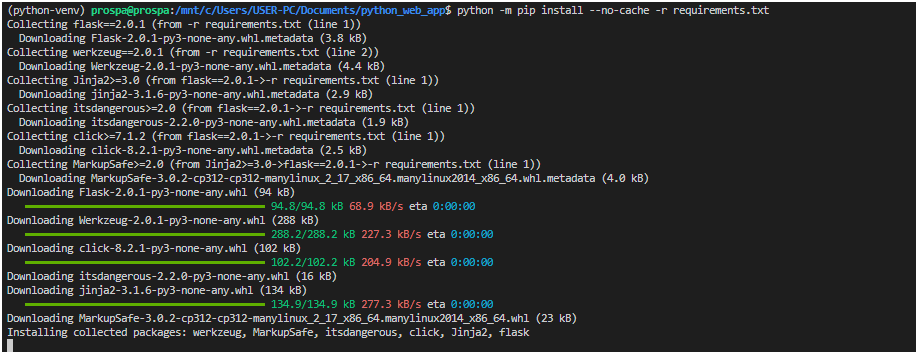
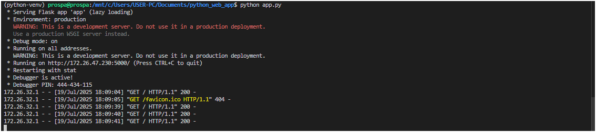
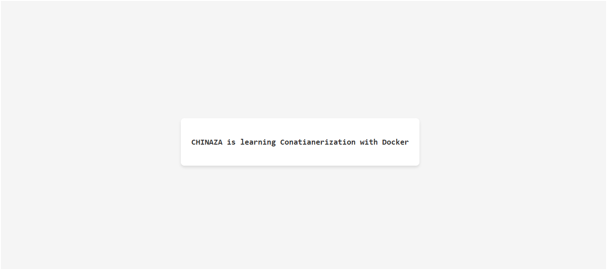
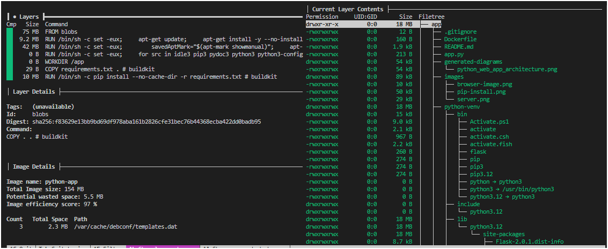

# Simple Python Web Application

A simple Flask web application that displays "Steven is Learning Devops" in the browser.

## Running the Application Locally

### Prerequisites
- Python 3.6 or higher
- pip (Python package manager)

### Steps

1. Clone or download this repository
2. Navigate to the project directory:
   ```
   cd python_web_app
   ```
3. Create a virtual environment (optional but recommended):
   ```
   python3 -m venv venv
   source venv/bin/activate  # On Windows: venv\Scripts\activate
   ```

   NOTE: if your virtual environment installs without pip youll get an error saying  this is an externally managed environment, youll need to install pip within the bin directory of your venv file, to to this use the command within the venv ```python -m ensurepip``` this command installs python pip in the virtual environment. You can also do this command ```python -m pip install -r requirements.txt``` 


4. Install the required dependencies:
   ```
   pip install -r requirements.txt
   ```
   image of successfull installation 

   


5. Run the application:
   ```
   python app.py
   ```

   when the application runs, youll get a terminal output such as this below


6. Open your web browser and navigate to:
   ```
   http://172.26.47.230:5000
   ```
Our application looks like this over the browser



## Observations
- Bad container images often arise when we just do not pay attention to the needs of our applications. as a newbie its often the case where we tend to use the COPY command carelessly and thus build our application image with files and folders that should be nowhere near our containers 



from this image you can see that, the application files such as ```.gitignore``` , ```README.md```, even the ```python-venv```  directory were copied into the container bloating the overall image size


## Running as a Docker Container

### Prerequisites
- Docker installed on your system

### Steps

1. Navigate to the project directory:
   ```
   cd python_web_app
   ```
2. Build the Docker image:
   ```
   docker build -t devops-learning-app .
   ```
3. Run the Docker container:
   ```
   docker run -p 5000:5000 devops-learning-app
   ```
4. Open your web browser and navigate to:
   ```
   http://localhost:5000
   ```

## Stopping the Application

- If running locally: Press `Ctrl+C` in the terminal
- If running as a Docker container: 
  ```
  docker ps  # Find the container ID
  docker stop <container_id>
  ```
